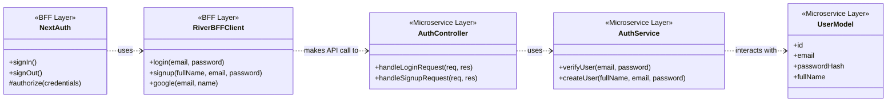

# System Architecture & Design

This document provides a comprehensive breakdown of the project structure, workflow, and class diagrams for the entire SmartRefill system, based on the agreed-upon architectural principles.

---

### 1. Project Structure

#### a. `smartrefill` (The Monolith: Frontend + BFF)

This is the primary Next.js project, serving as both the **Frontend App** and the **BFF (Backend-for-Frontend) Layer**.

```plaintext
smartrefill/
├── .next/              # Next.js build output
├── .vscode/            # VS Code editor settings
├── docs/
│   └── architecture.md # This document
├── jest.config.js      # Jest test runner configuration
├── jest.setup.js       # Jest test setup file
├── node_modules/       # Project dependencies
├── public/             # Static assets (images, fonts)
├── src/
│   ├── app/
│   │   ├── api/
│   │   │   └── auth/
│   │   │       └── [...nextauth]/
│   │   │           └── route.ts      # (BFF) NextAuth.js API endpoint for auth
│   │   ├── (main)/                   # Main app routes (e.g., dashboard)
│   │   ├── layout.tsx                # Root layout for the application
│   │   └── page.tsx                  # Landing page component
│   ├── components/       # (Frontend) Reusable React components
│   │   ├── landing/
│   │   │   ├── index.tsx
│   │   │   └── constants.tsx         # Content and data for landing page
│   │   └── ui/                       # Generic UI elements (buttons, etc.)
│   ├── lib/
│   │   ├── river-bff/                # (BFF) Mock client for the microservice
│   │   │   ├── __tests__/
│   │   │   │   └── index.test.ts     # Unit tests for the BFF client
│   │   │   └── index.ts              # The client library itself
│   │   └── ...
│   ├── styles/
│   │   └── globals.css   # Global stylesheets
│   └── ...
├── .env.local          # Secret environment variables (NEXTAUTH_SECRET, etc.)
├── next.config.mjs     # Next.js configuration
├── package.json        # Project metadata and scripts
└── tsconfig.json       # TypeScript configuration
```

#### b. `river-bff` (As an Independent Library)

If `river-bff` were a separate, reusable NPM package, it would be structured like this. Its purpose is to provide a simple, typed SDK for any frontend to communicate with the `river-microservice`.

```plaintext
river-bff/
├── dist/                 # Compiled JavaScript output
├── src/
│   ├── index.ts          # Main library entry point (exports all functions)
│   ├── auth.ts           # Functions for authentication (login, signup)
│   ├── billing.ts        # Functions for billing API calls
│   └── user.ts           # Functions for user profile management
├── __tests__/
│   ├── auth.test.ts      # Tests for authentication functions
│   └── ...
├── package.json          # Library dependencies (e.g., axios)
└── tsconfig.json         # TypeScript configuration
```

#### c. `river-microservice` (The Backend Service)

This is the pure backend service. It handles business logic and direct database interactions. It exposes a REST or RPC API that the `river-bff` library consumes.

```plaintext
river-microservice/
├── src/
│   ├── api/
│   │   ├── controllers/  # Handles incoming HTTP requests and responses
│   │   │   ├── auth.controller.ts
│   │   │   └── user.controller.ts
│   │   └── routes/       # Defines API routes (e.g., /auth/login)
│   │       ├── auth.routes.ts
│   │       └── user.routes.ts
│   ├── core/
│   │   ├── services/     # Contains the core business logic
│   │   │   ├── auth.service.ts
│   │   │   └── user.service.ts
│   │   └── models/       # Database schemas or data models
│   │       └── user.model.ts
│   ├── config/           # Configuration (database, environment variables)
│   └── app.ts            # Main application setup (Express.js, etc.)
├── package.json          # Service dependencies (Express, Prisma, etc.)
└── tsconfig.json         # TypeScript configuration
```

---

### 2. Overall Workflow (User Login Example)

This illustrates how the layers interact during a typical login flow.


---

### 3. Class Diagram (Authentication Components)

This diagram shows the key software components involved in the authentication process and their relationships.


